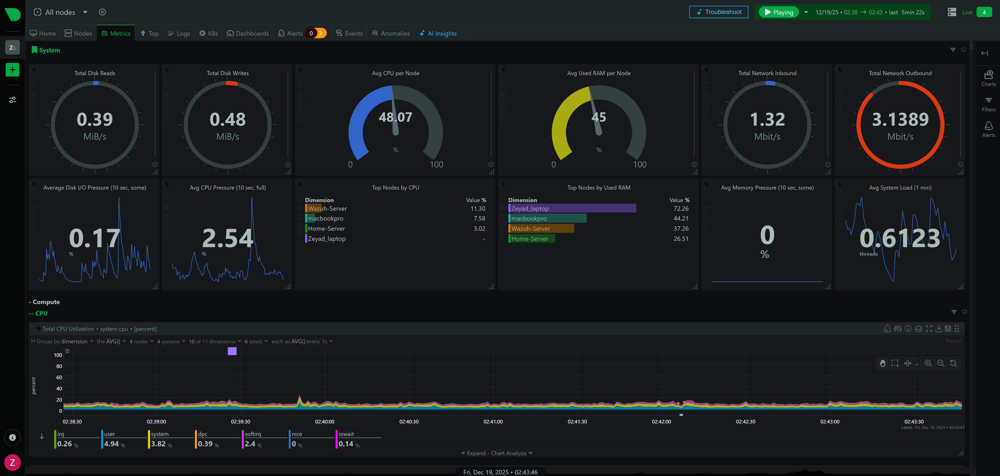

# Hybrid Infrastructure Observability & Security Lab

## Project Overview
This project demonstrates the implementation of a **Unified Monitoring & Incident Response System** for a complex, hybrid home lab environment. By integrating **Netdata** with **Wazuh SIEM**, I established a central "Single Pane of Glass" to monitor the health, performance, and security of diverse operating systems (Linux, Windows, macOS) and containerized applications.

The goal was to move from reactive troubleshooting to **proactive observability**, reducing Mean Time to Detect (MTTD) for both performance anomalies and security threats.

## Dashboard Preview

*Real-time visibility across 4 critical nodes: Linux Server (Wazuh-Server), Raspberry Pi (Home-Server), Windows 11, and macOS.*

## Architecture Topology
The infrastructure consists of 4 managed nodes and segmented IoT devices:

| Node Name | OS / Type | Role |
| :--- | :--- | :--- |
**Home-Server** | Ubuntu Server (Raspberry Pi) + CasaOS | **Docker Host** running core services (Pi-hole, NAS) & Containerized Monitoring. |
| **Wazuh-Server** | Ubuntu Server (VM) | Dedicated **SIEM Manager** for log analysis and threat detection. |
| **Zeyad_laptop** | Windows 11 | Primary Administrative Workstation & Endpoint. |
| **macbookpro** | macOS (Unix) | Development & Creative Workstation. |

## Technologies Stack
* **Monitoring Engine:** Netdata (Deployed via Docker, Native Agents, & Homebrew).
* **Security:** Wazuh SIEM (Endpoint Security & Log Analysis).
* **Containerization:** Docker & Docker Compose.
* **Alerting:** Automated integration with **Telegram API** for critical notifications.

## Implementation Highlights & Challenges

### 1. Cross-Platform Deployment Strategy
* **Linux (Raspberry Pi):** Utilized `docker-compose` to isolate the monitoring agent from core system processes.
* **Windows 11:** Deployed native MSI installer to capture OS-specific metrics (Registry, Services).
* **macOS:** Deployed via Terminal using custom environment configurations.

### 2. Solving the macOS Bash Compatibility Issue 

macOS ships with a legacy version of Bash (v3.2) due to licensing restrictions. The Netdata installation script requires features found in modern Bash (v4.0+), causing the standard deployment to fail with syntax errors.

I resolved the dependency at the environment level by upgrading the local shell environment using **Homebrew** (`brew install bash`). This updated the system's path to prioritize the modern Bash version, allowing the standard Netdata installation script to execute successfully without complex workarounds.

### 3. Resource Optimization
Tuned monitoring agents to consume **<1% CPU** on the Wazuh Server to ensure that the observability layer does not impact the performance of the SIEM engine.

## Future Roadmap
* **Red Teaming:** Conducting attack simulations using **Atomic Red Team** to test Wazuh's detection capabilities.
* **Active Directory:** Deploying a Windows Server Domain Controller and hydrating it with **BadBlood** to practice Identity Security monitoring.

---
**Project executed by [Zeyad AlRashed](https://www.linkedin.com/in/zeyad-alrashed-0155b9333/)**
